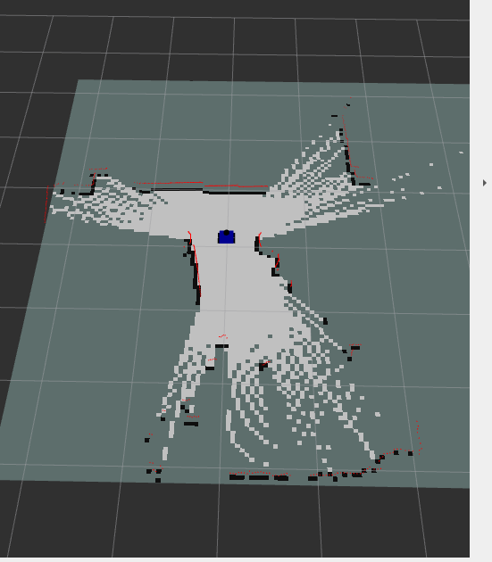
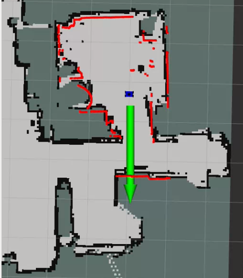

# ROS 2 LidarBot (Raspberry Pi 5)

**Raspberry Pi 5**와 **RPLidar**, **ROS 2**를 활용한 2D 자율 주행 로봇 프로젝트입니다.  
엔코더 없이 라이다 오도메트리(**RF2O**)를 활용하여 **SLAM(지도 작성)**과 **Navigation2(자율 주행)**를 수행합니다.

---

## 하드웨어 구성 (Hardware Setup)

### 부품 목록
* **SBC:** Raspberry Pi 5 (Ubuntu 24.04 / ROS 2 Jazzy)
* **Lidar:** RPLidar A1 (USB Serial)
* **Motor Driver:** L298N
* **Chassis:** 4-Wheel Differential Drive (TT Motor)
* **Power:** 18650 Battery (High Current)

### GPIO 핀 맵 (Pinout - Board Mode)
| 구분 | 물리 핀 번호 (Physical Pin) | 역할 |
| :--- | :---: | :--- |
| **Left Motor (IN1, IN2)** | 37, 40 | 방향 제어 |
| **Left PWM (ENA)** | 7 | 속도 제어 |
| **Right Motor (IN3, IN4)** | 12, 13 | 방향 제어 |
| **Right PWM (ENB)** | 11 | 속도 제어 |

---

## 설치 및 빌드 (Installation)

### 1. 필수 패키지 설치
라즈베리파이 터미널에서 아래 명령어를 실행하여 필요한 의존성 패키지를 설치합니다.

```bash
sudo apt update
sudo apt install ros-jazzy-rplidar-ros \
                 ros-jazzy-rf2o-laser-odometry \
                 ros-jazzy-slam-toolbox \
                 ros-jazzy-navigation2 \
                 ros-jazzy-nav2-bringup \
                 ros-jazzy-robot-state-publisher \
                 ros-jazzy-joint-state-publisher \
                 python3-rpi-lgpio  # RPi 5 GPIO 호환 라이브러리
```

소스를 빌드하고 환경 변수를 설정

```bash

cd ~/ros_ws
colcon build --symlink-install
source install/setup.bash
sudo chmod 666 /dev/ttyUSB0
```
### 2. SLAM(지도작성)

```bash
ros2 launch ros2_lidar bringup_launch.py
ros2 run teleop_twist_keyboard teleop_twist_keyboard
ros2 run nav2_map_server map_saver_cli -f ~/my_map
```

### 3. Navigation (자율 주행)

```bash
ros2 launch ros2_lidar nav_launch.py
```

### 4. 프로젝트 구조
```bash
ros2_lidar/
├── config/
│   ├── nav2_params.yaml    # 내비게이션 파라미터 (MPPI Controller, Costmap)
│   └── slam_params.yaml    # SLAM Toolbox 설정 파일
├── launch/
│   ├── bringup_launch.py   # SLAM 및 하드웨어 구동 런치 파일
│   └── nav_launch.py       # 내비게이션 실행 런치 파일
├── maps/
│   ├── my_map.pgm          # 저장된 지도 이미지
│   └── my_map.yaml         # 지도 메타데이터
├── scripts/
│   └── pi_car.py           # DC 모터 제어 노드 (RPi.GPIO)
├── urdf/
│   └── picar.urdf          # 로봇 모델링 (Lidar, Chassis, Wheels)
└── package.xml
```
